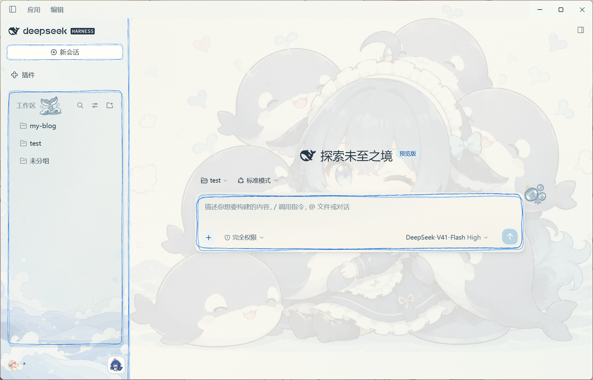
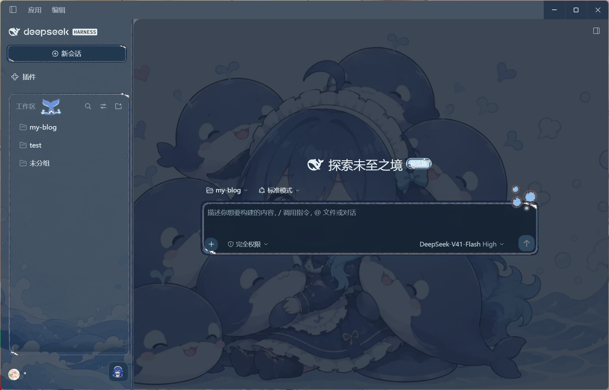
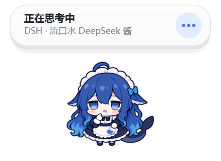

# dsh-maid-whale-UI

[](https://awesome-dsh-plugin.com)

[English](README.en.md) | 中文

适用于 DeepSeek Harness 桌面端和 Web UI 的鲸鱼女仆主题插件：提供亮暗双主题、海洋插画壁纸、手绘边框，以及随 DSH 启停的原生 Windows 鲸鱼桌宠。

## 主题和 Pet 预览

主题截图来自 DeepSeek Harness 桌面端 0.1.7-rc.2。

| 亮色模式 | 暗色模式 |
| --- | --- |
| [](maid-whale-webui/preview/desktop-light.png) | [](maid-whale-webui/preview/desktop-dark.png) |

### Pet 预览

[](maid-whale-webui/preview/pet-thinking.png)

## 安装说明

### 环境要求

- 可正常运行的 DSH（DeepSeek Harness）桌面端或 Web UI。
- Windows 10/11 x64：原生桌宠仅支持 Windows；单独使用 Web UI 主题不受此限制。
- 无需另外安装 Python 或 Node：桌宠帮助程序已包含在插件包中。

### 让 DSH 安装

直接对 DSH 说：

```text
安装一下这个皮肤包：https://github.com/yunxiiQwQ/dsh-maid-whale-UI/tree/main/maid-whale-webui
```

### 桌面端安装

完全退出 DSH（包括托盘进程），在可使用 DSH CLI 的终端中执行：

```powershell
git clone https://github.com/yunxiiQwQ/dsh-maid-whale-UI.git
cd dsh-maid-whale-UI
dsh plugin --profile desktop add ./maid-whale-webui
```

随后从桌面快捷方式打开 DeepSeek Harness。桌面端和 Web 端使用独立的 profile。桌宠菜单中的 **打开 DSH** 会通过 `dsh://open` 唤起桌面窗口，无需配置固定的本地端口。

### Web 端安装

```powershell
# 1. 完全退出 DSH（包括托盘进程）
# 2. 克隆仓库并添加插件
git clone https://github.com/yunxiiQwQ/dsh-maid-whale-UI.git
cd dsh-maid-whale-UI
dsh plugin --profile web add ./maid-whale-webui

# 3. 启动 DSH Web UI
dsh --profile web
```

主题会在启动后自动应用，桌宠也会自动出现。若桌宠未显示，请前往 **设置 → 插件 → 插件配置 → 鲸鱼桌宠** 检查启用开关。工作区面板右下角的鲸鱼按钮也可即时启停桌宠；同一时间建议只启用一个界面主题。

### 更新与卸载

```powershell
# 更新任一版本：完全退出 DSH，在仓库目录拉取最新版本，再重新打开
git pull

# 卸载：先完全退出 DSH
# 桌面端
dsh plugin --profile desktop remove @yunxii/dsh-client-ui-skin-maid-whale-webui

# Web 端
dsh plugin --profile web remove @yunxii/dsh-client-ui-skin-maid-whale-webui
```

## Pet 动作和触发

| 动作 | 触发条件 |
| --- | --- |
| 待机 | DSH 空闲、没有正在处理的会话 |
| 休眠 | 桌宠与 DSH 断开连接 |
| 思考 | 新任务开始、Agent 分析或整理工具结果 |
| 工作 | Agent 编辑文件、使用普通工具或处于通用工作阶段 |
| 查找 | 搜索、读取、抓取或打开内容 |
| 执行命令 | 执行 Shell、终端、PowerShell 等命令 |
| 验证 | 测试、检查、构建、Lint 或验证 |
| 等待确认 | Agent 提问、请求审批或任务被阻塞 |
| 成功 | 任务正常完成时短暂播放 |
| 错误 | 工具失败、任务异常结束或达到限制 |
| 拖动 | 按住桌宠移动超过拖动阈值 |
| 摸头 | 单击桌宠上半部，或双击桌宠 |
| 戳一戳 | 单击桌宠主体区域 |
| 碰尾巴 | 单击桌宠右侧尾巴区域 |
| 空闲小动作 | 空闲且未开启“减少动态效果”时随机播放 |

交互动作结束后，桌宠会回到最新的 Agent 状态。多会话同时活动时，显示优先级为：等待确认 → 错误 → 工作 → 思考 → 空闲。

## 工程结构与开发

仓库根目录提供文档和命令入口，可安装的插件位于 `maid-whale-webui/`：

| 路径 | 用途 |
| --- | --- |
| `src/client/` | 主题样式、边框、装饰和桌宠设置 |
| `src/index.ts`、`src/host/` | Host 入口、DSH 事件和桌宠进程桥接 |
| `runtime/` | Python/Qt 桌宠与 Windows 可执行文件 |
| `assets/`、`preview/` | 原始美术素材与界面预览 |
| `build/`、`scripts/` | 打包配置、素材嵌入和发布检查 |
| `tests/`、`runtime/tests/` | 客户端、Host 和 Python 测试 |
| `lib/` | 随仓库提交、供 DSH 加载的客户端和 Host 构建产物 |

开发需要 Node.js 22.19+ 和 pnpm 11.21.0。从仓库根目录执行：

```bash
cd maid-whale-webui
pnpm install --frozen-lockfile
pnpm art:embed:check
pnpm lint
pnpm typecheck
pnpm test
pnpm build
pnpm pack:check
```

修改美术素材后，先运行 `pnpm art:embed` 再构建；源码改动应连同更新后的 `lib/` 一起提交。开发桌宠时，安装 `requirements.txt` 和 `requirements-test.txt` 中的依赖，再运行 `pnpm test:python`。Windows 下通过 `pnpm build:helper:windows` 使用构建依赖生成可执行文件和 SHA-256 校验文件。

桌面端与 Web 端共用客户端构建产物。消息样式兼容 `ui-chat` 和 `ui-conversation` 模块；桌面窗口保留应用标题和图标。

## 声明

- 代码使用 BSD-3-Clause 许可证。
- 本项目是非官方社区主题，与 DeepSeek 官方无隶属或背书关系；角色与插画素材来源于社区二创。
- 桌宠的 Node 侧伴侣代码与 Python runtime 基于 [QCYTSN/dsh-dafeiyu](https://github.com/QCYTSN/dsh-dafeiyu)（MIT），完整归属说明见 [`maid-whale-webui/NOTICE`](maid-whale-webui/NOTICE)。
- 插件仅使用 DSH 官方客户端插件机制，不修改 DeepSeek Harness 源码，也不介入模型请求。
- 桌宠不存储密钥、不截图、无遥测、不新增网络端口，只响应 DSH 自身事件。
